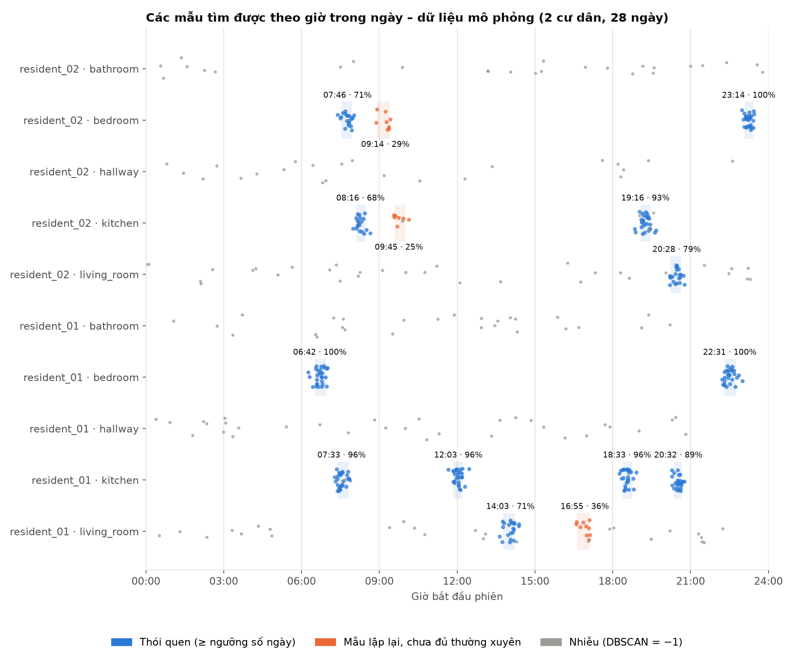

# Học thói quen của con người trong ngôi nhà thông minh


| | |
|---|---|
| **Đề tài** | Học thói quen của con người trong ngôi nhà thông minh từ dữ liệu cảm biến |
| **Sinh viên thực hiện** | Nguyễn Văn Biển |
| **Giảng viên hướng dẫn** | Vũ Thị Hồng Nhạn |
| **Đơn vị** | UET-VNU |
| **Slide** | [reports/slide_thuyet_trinh.html](reports/slide_thuyet_trinh.html) (tải repo về rồi mở bằng trình duyệt) |
| **Mới đọc repo?** | Bắt đầu từ [docs/README.md](docs/README.md) |

Đề tài **tự động tìm các hành động thường xuyên, tuần hoàn của con người từ dữ liệu cảm biến trong nhà thông minh**, không dùng nhãn. Kết quả là các thói quen có thể đọc được, ví dụ:

> *resident_01 · bếp · **20:32** (80% số lần trong 20:20–20:40) · ~3 phút · **25/28 ngày** · cảm biến hộp thuốc* → thói quen uống thuốc buổi tối.
>
> Ví dụ này lấy từ **dữ liệu mô phỏng**, nơi thói quen uống thuốc được cài sẵn làm đáp án. Trên dữ liệu thật Aruba, phương pháp tìm ra giấc ngủ (~00:18) và bữa sáng (~09:04).

**Mục lục:** [Kết quả chính](#kết-quả-chính) · [Cài đặt](#cài-đặt) · [Chạy lại thực nghiệm](#chạy-lại-toàn-bộ-thực-nghiệm) · [Dùng dữ liệu của bạn](#dùng-dữ-liệu-của-bạn) · [Tài liệu](#tài-liệu) · [Cấu trúc mã nguồn](#cấu-trúc-mã-nguồn) · [Tài liệu tham khảo](#tài-liệu-tham-khảo)

Đề tài gồm đúng hai bước:

1. **Tiền xử lý:** làm sạch log cảm biến, gom sự kiện thành **phiên** (một lần ở liên tục trong một phòng), trích đặc trưng.
2. **Định nghĩa và tìm mẫu:** *thói quen* = các phiên của cùng người, cùng phòng, bắt đầu trong khoảng ~30 phút, thời lượng tương tự, lặp lại ở ≥ 50% số ngày. Kỹ thuật duy nhất: **DBSCAN** trong không gian có đơn vị *giờ*.

Robot, hệ thống nhắc nhở hay dự đoán hành động nằm **ngoài phạm vi**.

## Kết quả chính

| | Dữ liệu mô phỏng (có đáp án) | STRANDS Aruba (dữ liệu thật) |
|---|---|---|
| Quy mô | 2 người · 28 ngày · 3.397 sự kiện | 1 người · 112 ngày · 161.280 phút |
| Thói quen tìm được | **12/12** thói quen cài sẵn, kể cả uống thuốc 20:32 | **5** thói quen: ngủ ~00:18, nấu bữa sáng ~09:04, ... |
| Khớp với nhãn thật (chỉ để đánh giá) | ARI 0,96 · độ thuần 100% | độ thuần 79% (ngủ 100%, nấu ăn 92%) |
| Độ lệch giờ trong cụm, so với baseline | 182 → **10 phút** | 289 → **115 phút** |



## Cài đặt

Python 3.10+.

```powershell
python -m venv .venv
.\.venv\Scripts\Activate.ps1
pip install -e ".[dev]"
```

## Chạy lại toàn bộ thực nghiệm

```powershell
# Thí nghiệm 1 – dữ liệu mô phỏng
smart-home generate-demo
smart-home run

# Thí nghiệm 2 – dữ liệu thật STRANDS Aruba (tải ~30 kB từ LCAS)
smart-home download-strands
smart-home run --config configs/strands_aruba.yaml

# So sánh với baseline, ablation, phân tích độ nhạy
smart-home experiments

# Kiểm thử
python -m pytest
```

Nếu chưa cài bằng `pip install -e .`, thay `smart-home` bằng `python -m smart_home_patterns.cli` (đặt `PYTHONPATH=src`).

Mỗi lần `run` ghi ra `reports/results/<tên>/`:

| File | Nội dung |
|---|---|
| `habit_report.md` | Báo cáo đọc được: số liệu tiền xử lý, tham số, bảng thói quen |
| `habits.csv` | Mỗi dòng một mẫu: người, phòng, giờ điển hình, khung 80%, thời lượng, số ngày, tần suất, `is_habit` |
| `metrics.json` | Tham số và chỉ số (số cụm, tỷ lệ nhiễu, silhouette, ARI/NMI/độ thuần) |
| `figures/habit_timeline.png` | Các phiên theo giờ trong ngày, tô màu thói quen / mẫu thỉnh thoảng / nhiễu |
| `figures/actogram.png` | Nhật ký vị trí theo từng ngày |
| `figures/k_distance.png` | Cơ sở chọn `eps` |
| `figures/label_matrix.png` | Đối chiếu thói quen với nhãn thật |

Dữ liệu trung gian (`clean_events.csv`, `sessions.csv`) nằm trong `data/processed/<tên>/` và không được commit.

## Dùng dữ liệu của bạn

Chuẩn bị CSV với các cột `timestamp, resident_id, room, sensor_type, sensor_id, value, event_type` (tuỳ chọn thêm `activity_label` để đánh giá), rồi:

```powershell
smart-home run --input path/to/events.csv
```

Tham số nằm trong [configs/config.yaml](configs/config.yaml), mỗi dòng có chú thích.

## Tài liệu

> **Mới tiếp cận repo?** Bắt đầu từ [docs/README.md](docs/README.md): lộ trình đọc, giải thích chi tiết dữ liệu, từng quyết định thiết kế và cách đọc code.

Báo cáo nộp:

| File | Nội dung |
|---|---|
| [reports/01_tong_quan_de_tai.md](reports/01_tong_quan_de_tai.md) | Bối cảnh, câu hỏi nghiên cứu, phạm vi, định nghĩa thói quen, liên hệ tài liệu tham khảo |
| [reports/02_du_lieu.md](reports/02_du_lieu.md) | Schema, bộ dữ liệu mô phỏng, dữ liệu STRANDS Aruba và kiểm định mã vị trí |
| [reports/03_phuong_phap.md](reports/03_phuong_phap.md) | Chi tiết B1 và B2: công thức, tham số, lý do thiết kế, cách đánh giá |
| [reports/04_ket_qua_thuc_nghiem.md](reports/04_ket_qua_thuc_nghiem.md) | Kết quả, so sánh baseline, ablation, độ nhạy, hạn chế |
| [reports/05_kich_ban_thuyet_trinh.md](reports/05_kich_ban_thuyet_trinh.md) | Kịch bản thuyết trình và câu hỏi phản biện |
| [reports/slide_thuyet_trinh.html](reports/slide_thuyet_trinh.html) | Slide thuyết trình (mở bằng trình duyệt; `N` = ghi chú, `F` = toàn màn hình) |

## Cấu trúc mã nguồn

```text
configs/                 config.yaml (mô phỏng), strands_aruba.yaml (dữ liệu thật)
src/smart_home_patterns/
  preprocessing.py       B1: làm sạch, gom phiên, đặc trưng
  discovery.py           B2: không gian "giờ", DBSCAN theo người × phòng, mô tả thói quen
  pipeline.py            chạy B1 → B2, ghi báo cáo
  plots.py               hình cho báo cáo
  experiments.py         baseline, ablation, độ nhạy
  demo.py                sinh dữ liệu mô phỏng có đáp án
  strands_adapter.py     đọc bộ dữ liệu STRANDS (location.min / activity.min)
  cli.py                 lệnh smart-home
tests/                   21 kiểm thử (pytest)
reports/                 báo cáo nộp, slide, kết quả
docs/                    tài liệu hướng dẫn hiểu repo (bắt đầu từ docs/README.md)
```

## Tài liệu tham khảo

- P. Duckworth, D. C. Hogg, A. G. Cohn. *Unsupervised human activity analysis for intelligent mobile robots.* Artificial Intelligence 270:67–92, 2019. doi:10.1016/j.artint.2018.12.005
- C. Coppola, T. Krajník, N. Bellotto, T. Duckett. *Learning temporal context for activity recognition.* ECAI 2016 — bộ dữ liệu STRANDS long-term person activity: <https://lcas.lincoln.ac.uk/nextcloud/shared/datasets/activity.html>
- D. J. Cook. *Learning setting-generalized activity models for smart spaces.* IEEE Intelligent Systems, 2010 — dữ liệu CASAS Aruba.
- M. Ester, H.-P. Kriegel, J. Sander, X. Xu. *A density-based algorithm for discovering clusters in large spatial databases with noise.* KDD 1996.
