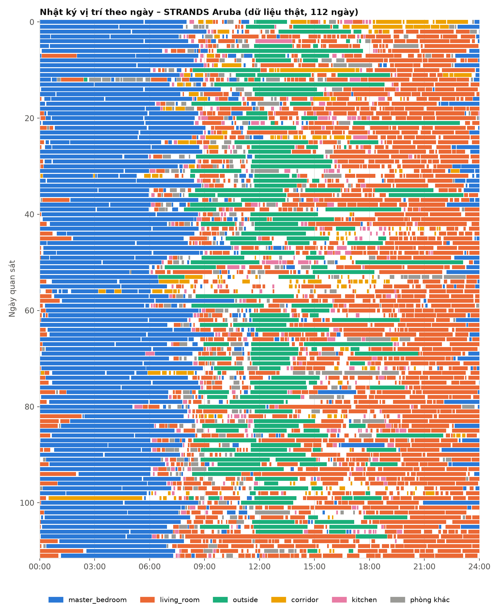
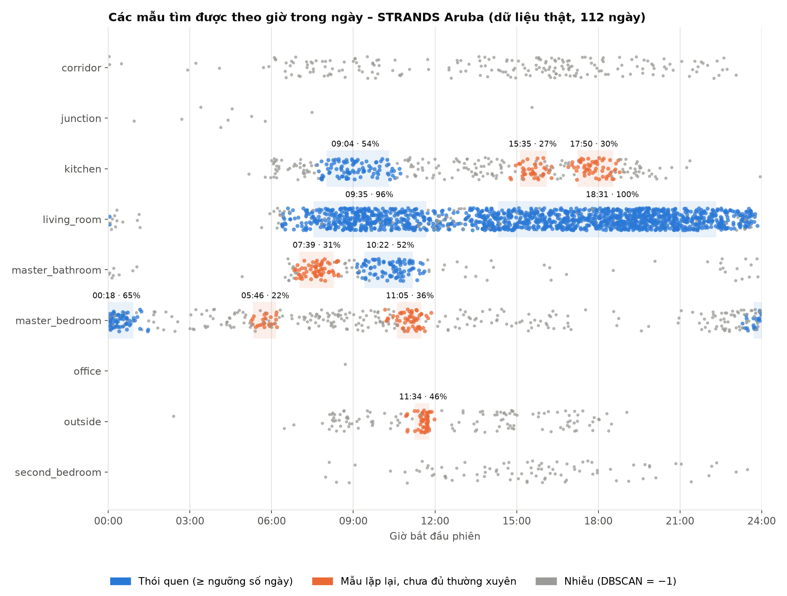
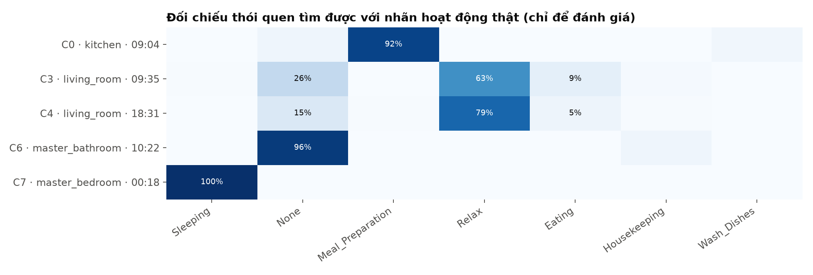

# 4. Kết quả thực nghiệm và thảo luận

Tái lập toàn bộ kết quả trong tài liệu này:

```powershell
smart-home generate-demo;    smart-home run                                        # Thí nghiệm 1
smart-home download-strands; smart-home run --config configs/strands_aruba.yaml    # Thí nghiệm 2
smart-home experiments                                                             # So sánh + độ nhạy
```

Kết quả gốc (sinh tự động, không sửa tay): [results/demo/](results/demo/habit_report.md), [results/strands_aruba/](results/strands_aruba/habit_report.md), [results/experiments/](results/experiments/experiments.md).

---

## 4.1. Thí nghiệm 1 – Dữ liệu mô phỏng (biết trước đáp án)

### Bước 1 – Tiền xử lý

3.397 sự kiện thô → **3.339** sự kiện sạch (loại 50 dòng trùng + 8 timestamp hỏng; điền 33 giá trị thiếu; chuẩn hoá 67 tên phòng) → **501 phiên**.

### Bước 2 – Thói quen tìm được

`eps` = 0,5 giờ, `min_samples` = 6 (= ⌈0,2 × 28⌉), `min_support` = 50%.

| Cụm | Cư dân | Phòng | Giờ điển hình | Khung 80% | Thời lượng | Số ngày | Nhãn thật (độ thuần) |
|---|---|---|:---:|:---:|---:|---:|---|
| C0 | resident_01 | bedroom | **06:42** | 06:31–06:57 | 15' | 28/28 | wake_up (100%) |
| C2 | resident_01 | kitchen | **07:33** | 07:23–07:49 | 20' | 27/28 | breakfast (100%) |
| C3 | resident_01 | kitchen | **12:03** | 11:52–12:12 | 28' | 27/28 | lunch (100%) |
| C6 | resident_01 | living_room | **14:03** | 13:46–14:13 | 58' | 20/28 | watch_tv (100%) |
| C4 | resident_01 | kitchen | **18:33** | 18:22–18:45 | 30' | 27/28 | dinner (100%) |
| **C5** | **resident_01** | **kitchen** | **20:32** | **20:20–20:40** | **3'** | **25/28** | **take_medicine (100%)** |
| C1 | resident_01 | bedroom | **22:31** | 22:18–22:45 | 10' | 28/28 | go_to_bed (100%) |
| C8 | resident_02 | bedroom | **07:46** | 07:32–07:57 | 11' | 20/28 | wake_up (100%) |
| C11 | resident_02 | kitchen | **08:16** | 08:07–08:28 | 16' | 19/28 | breakfast (100%) |
| C13 | resident_02 | kitchen | **19:16** | 19:05–19:27 | 27' | 26/28 | dinner (100%) |
| C14 | resident_02 | living_room | **20:28** | 20:13–20:38 | 97' | 22/28 | watch_tv (100%) |
| C10 | resident_02 | bedroom | **23:14** | 23:05–23:25 | 9' | 28/28 | go_to_bed (100%) |

**Mẫu lặp lại nhưng không đủ thường xuyên:** C7 – resident_01 tập thể dục ở phòng khách 16:55 (10/28 ngày = 36%); C9, C12 – resident_02 dậy lúc 09:14 và ăn sáng lúc 09:45 (8/28 và 7/28 ngày ≈ số ngày cuối tuần).


**Nhận xét**

- Tìm lại **đủ 12/12 thói quen** cài sẵn với giờ điển hình lệch < 5 phút so với giá trị cài đặt, độ thuần nhãn **100%**, ARI = 0,959, NMI = 0,981.
- **Thói quen uống thuốc** (C5) được tìm ra đúng như ví dụ của đề bài: ở bếp, ~20:32, khoảng 3 phút, 25/28 ngày (khớp xác suất 85% đã cài), tổ hợp cảm biến có `pillbox`. Dù cùng phòng bếp với bữa tối lúc 18:33, hai mẫu vẫn tách riêng nhờ khác giờ và khác thời lượng.
- **Ngưỡng tần suất hoạt động đúng vai trò:** tập thể dục (30%) và lịch cuối tuần của resident_02 được tìm thấy như những mẫu *có lặp lại*, nhưng không bị báo nhầm thành thói quen hằng ngày.
- **Lọc nhiễu:** cả **164/164** lần đi ngang ngẫu nhiên bị gán nhãn nhiễu. Nhiễu có tổng 177 phiên; 13 phiên còn lại là hoạt động thật nhưng rơi vào giờ lệch bất thường — đúng tinh thần "hành vi khác thường".

---

## 4.2. Thí nghiệm 2 – STRANDS Aruba (dữ liệu thật)

### Bước 1 – Tiền xử lý

161.280 phút → **15.176 phiên** (mỗi lần đổi phòng là một phiên mới) → giữ **3.015 phiên ≥ 5 phút** (12.161 lần chỉ đi ngang một phòng bị loại).



Biểu đồ trên (mỗi hàng là một ngày) cho thấy ngay bằng mắt thường một nhịp sinh hoạt: dải ngủ ở phòng ngủ (xanh dương) từ khuya đến ~08:00, thời gian ở phòng khách (cam) kéo dài buổi chiều tối, những lần ra ngoài (xanh lá) giữa ngày. Nhiệm vụ của B2 là biến quan sát trực giác đó thành kết quả định lượng.

### Bước 2 – Thói quen tìm được

`eps` = 0,5 giờ, `min_samples` = 23 (= ⌈0,2 × 112⌉), `min_support` = 50%.

| Cụm | Phòng | Giờ điển hình | Khung 80% | Thời lượng | Số ngày | Nhãn thật (độ thuần) | Diễn giải |
|---|---|:---:|:---:|---:|---:|---|---|
| C7 | master_bedroom | **00:18** | 23:43–00:55 | 333' | 73/112 | Sleeping (100%) | **Đi ngủ** quanh nửa đêm |
| C0 | kitchen | **09:04** | 08:01–10:18 | 8' | 60/112 | Meal_Preparation (92%) | **Chuẩn bị bữa sáng** |
| C3 | living_room | **09:35** | 07:32–11:41 | 11' | 108/112 | Relax (63%) | Ngồi phòng khách buổi sáng |
| C6 | master_bathroom | **10:22** | 09:25–11:11 | 13' | 58/112 | None (96%) | Vệ sinh buổi sáng *(không có nhãn gốc)* |
| C4 | living_room | **18:31** | 14:19–22:20 | 23' | 112/112 | Relax (79%) | Nghỉ ngơi chiều – tối |

**Mẫu lặp lại nhưng không đủ thường xuyên (< 50% số ngày)**

| Cụm | Phòng | Giờ | Thời lượng | Số ngày | Nhãn thật (độ thuần) | Diễn giải |
|---|---|:---:|---:|---:|---|---|
| C10 | outside | 11:34 | 146' | 51/112 (46%) | None (100%) | Ra ngoài ~2,5 giờ vào cuối buổi sáng |
| C9 | master_bedroom | 11:05 | 7' | 40/112 (36%) | None (94%) | Quay lại phòng ngủ cuối buổi sáng |
| C5 | master_bathroom | 07:39 | 12' | 35/112 (31%) | None (98%) | Vệ sinh sáng sớm |
| C2 | kitchen | 17:50 | 7' | 33/112 (30%) | Meal_Preparation (80%) | Chuẩn bị bữa tối |
| C1 | kitchen | 15:35 | 8' | 30/112 (27%) | None (49%) | Vào bếp buổi chiều |
| C8 | master_bedroom | 05:46 | 161' | 25/112 (22%) | Sleeping (100%) | Ngủ tiếp sau khi thức giấc giữa đêm |





**Nhận xét**

- Các thói quen **có giờ giấc rõ ràng** được tìm ra với độ chính xác cao so với nhãn chuyên gia, dù thuật toán chỉ nhìn thấy *phòng* và *giờ*: **ngủ** (độ thuần 100%), **nấu bữa sáng** (92%). Tổng độ thuần 79%, NMI 0,45, ARI 0,36.
- **Phát hiện ngoài nhãn:** C6 (phòng tắm, ~10:22, 52% số ngày) gần như toàn bộ mang nhãn `None` — người gán nhãn không đặt tên cho hoạt động này, nhưng về hành vi thì đây rõ ràng là một thói quen buổi sáng lặp lại. Đây là giá trị đặc trưng của học không giám sát: tìm ra cả những mẫu con người chưa định nghĩa.
- Giấc ngủ bị chia thành hai mẫu (C7 bắt đầu ~00:18, C8 ~05:46) vì người dậy đi vệ sinh ban đêm (`Bed_to_Toilet`) làm cắt phiên — một hệ quả hợp lý của định nghĩa phiên "ở liên tục trong một phòng".
- **Hạn chế quan sát được:** hai cụm phòng khách có khung giờ rất rộng (C4: 14:19–22:20). Người này ngồi phòng khách gần như suốt buổi chiều tối, mật độ phiên cao liên tục, nên DBSCAN nối chúng thành một cụm dài (hiệu ứng *chaining*). Kết quả vẫn đúng về mặt hành vi ("chiều tối thường ở phòng khách") nhưng không cho ra một giờ cụ thể.
- ARI thấp hơn nhiều so với dữ liệu mô phỏng là **đúng kỳ vọng**: 34% thời gian mang nhãn `None`; *vị trí* không tương đương *hoạt động* (ăn và nghỉ đều ở phòng khách); và thói quen của người thật kém đều đặn hơn nhiều.

---

## 4.3. So sánh với cách làm ban đầu (baseline) và ablation

| Dữ liệu | Phương pháp | Số cụm | Tỷ lệ nhiễu | **Độ lệch giờ trong cụm** | ARI | NMI | Độ thuần |
|---|---|---:|---:|---:|---:|---:|---:|
| Mô phỏng | Baseline: DBSCAN trên toàn bộ đặc trưng | 9 | 4,8% | 182 phút | 0,552 | 0,796 | 0,925 |
| | **Đề xuất: DBSCAN theo người × phòng** | 15 | 35,3% | **10 phút** | **0,959** | **0,981** | **1,000** |
| | Ablation: không tách phiên khi đổi phòng | 13 | 35,7% | 10 phút | 0,967 | 0,986 | 1,000 |
| Aruba | Baseline | 9 | 8,1% | 289 phút | 0,032 | 0,116 | 0,449 |
| | **Đề xuất** | 11 | 34,3% | **115 phút** | **0,361** | **0,447** | **0,792** |
| | Ablation: không tách phiên khi đổi phòng | 0 | 100% | — | — | — | — |

**Vì sao baseline thất bại:** baseline chuẩn hoá và trộn 10 đặc trưng; 8 trong số đó (số sự kiện, số cảm biến, nhiệt độ, ánh sáng...) gần như giống nhau giữa các bữa ăn. Giờ trong ngày chỉ chiếm 2/10 chiều nên bị lấn át. Trên dữ liệu mô phỏng, baseline:
- gộp **bữa sáng của cả hai người với bữa trưa** của resident_01 vào một cụm (07:30–12:00), gộp bữa tối, giờ ngủ dậy, giờ đi ngủ **của hai người khác nhau** vào chung cụm — không trả lời được "*ai* làm việc đó *lúc mấy giờ*";
- gom **164 lần đi ngang ngẫu nhiên** thành một cụm lớn, vì các phiên này có đặc trưng gần như giống hệt nhau (1–3 sự kiện chuyển động). Tỷ lệ nhiễu thấp của baseline vì vậy *không phải* ưu điểm: nó biến nhiễu thành một "thói quen" giả.

**Ablation:** trên dữ liệu mô phỏng, bỏ tách-theo-phòng làm các cặp hoạt động liền nhau ở hai phòng (ngủ dậy ở phòng ngủ → ăn sáng ở bếp) bị gộp thành một phiên, nên mất thói quen ngủ dậy của resident_02 (11 thay vì 12 thói quen). Trên Aruba (dữ liệu theo phút, không bao giờ có khoảng lặng 30 phút), bỏ quy tắc này khiến cả 112 ngày thành **một phiên duy nhất** — chứng tỏ quy tắc tách khi đổi phòng là thành phần bắt buộc của B1.

---

## 4.4. Phân tích độ nhạy tham số

**Dữ liệu mô phỏng:** với cả 12 tổ hợp `eps` ∈ {0,25; 0,5; 0,75; 1,0} giờ × tỷ lệ `min_samples` ∈ {0,1; 0,2; 0,3}, phương pháp **luôn tìm đúng 12 thói quen**, độ thuần ≥ 0,997, ARI ≥ 0,957. Kết quả ổn định.

**Aruba:**

| `eps` (giờ) | tỷ lệ | Số cụm | Thói quen | Nhiễu | Độ lệch giờ | ARI | Độ thuần |
|---:|---:|---:|---:|---:|---:|---:|---:|
| 0,25 | 0,1 | 29 | 4 | 62% | 25' | 0,04 | 0,77 |
| 0,25 | 0,2 | 5 | 0 | 94% | 10' | 0,48 | 0,77 |
| 0,5 | 0,1 | 13 | 6 | 18% | 205' | 0,47 | 0,81 |
| **0,5** | **0,2** | **11** | **5** | **34%** | **115'** | **0,36** | **0,79** |
| 0,5 | 0,3 | 9 | 4 | 50% | 77' | 0,23 | 0,77 |
| 0,75 | 0,2 | 11 | 7 | 17% | 207' | 0,48 | 0,80 |
| 1,0 | 0,2 | 11 | 7 | 11% | 220' | 0,46 | 0,80 |

(bảng đầy đủ: [results/experiments/experiments.md](results/experiments/experiments.md))

- `eps` quá nhỏ (15 phút): dữ liệu thật dao động nhiều hơn 15 phút, hầu hết phiên thành nhiễu.
- `eps` ≥ 45 phút: nhiều thói quen hơn và ít nhiễu hơn, nhưng các cụm bị nối dài (độ lệch giờ > 3 giờ) — mất khả năng chỉ ra *giờ cụ thể*.
- Cấu hình mặc định (30 phút, 20% số ngày) là điểm cân bằng: được chọn trước theo ý nghĩa, và bảng độ nhạy xác nhận đây là vùng hợp lý chứ không phải kết quả tình cờ. **Độ thuần gần như không đổi (0,77–0,81)** trên mọi cấu hình: các cụm tìm được luôn có ý nghĩa, tham số chỉ quyết định độ "chặt" của khung giờ.

---

## 4.5. Trả lời câu hỏi nghiên cứu

- **RQ1 – Biểu diễn:** Đơn vị *phiên = một lần ở liên tục trong một phòng* (tách theo khoảng lặng 30 phút hoặc đổi phòng) phù hợp cho cả dữ liệu sự kiện cảm biến lẫn dữ liệu vị trí theo phút. Ablation cho thấy quy tắc đổi phòng là bắt buộc với dữ liệu theo phút.
- **RQ2 – Phát hiện:** DBSCAN trong không gian "giờ", chạy riêng theo người × phòng, tìm lại đủ 12/12 thói quen cài sẵn (kể cả uống thuốc) mà không biết trước số thói quen và không dùng nhãn; trên dữ liệu thật tìm ra giấc ngủ và bữa sáng với độ thuần 92–100%.
- **RQ3 – Nhiễu và ổn định:** 100% lần đi ngang ngẫu nhiên bị đánh dấu nhiễu; ngưỡng tần suất tách được mẫu thỉnh thoảng khỏi thói quen; kết quả ổn định trên dữ liệu mô phỏng. Trên dữ liệu thật, `eps` điều khiển sự đánh đổi giữa độ phủ và độ chính xác về giờ.

## 4.6. Hạn chế

1. **Một `eps` cho mọi phòng.** Thói quen đúng giờ (uống thuốc) và thói quen kéo dài (ngồi phòng khách) có mật độ rất khác nhau; một bán kính chung gây hiện tượng nối cụm ở phòng khách Aruba.
2. **Phiên chỉ mô tả vị trí + thời gian.** Hai hoạt động khác nhau ở cùng phòng, cùng giờ, cùng thời lượng (ăn và xem TV ở phòng khách) không phân biệt được nếu không có cảm biến thiết bị.
3. **Chưa khai thác chu kỳ tuần.** Lịch cuối tuần hiện chỉ lộ ra như một mẫu tần suất thấp; dữ liệu Aruba không có ngày tháng thật nên không kiểm tra được.
4. **Giả định biết người gây ra sự kiện.** Nhà nhiều người cần thiết bị định danh.
5. **Dữ liệu thật chỉ có một hộ** (Aruba). Cần thêm hộ gia đình để khẳng định tính tổng quát.

## 4.7. Hướng phát triển

- **HDBSCAN** (mật độ thay đổi) để tự thích nghi mật độ theo từng phòng, khắc phục hiện tượng nối cụm.
- Thêm trục ngày trong tuần (sin/cos theo tuần) khi dữ liệu có ngày tháng thật, để tìm thói quen theo tuần.
- Theo dõi thói quen theo thời gian (so sánh cụm giữa các tháng) để phát hiện thay đổi hành vi — nền tảng cho các ứng dụng như nhắc uống thuốc, vốn nằm ngoài phạm vi đề tài này.
